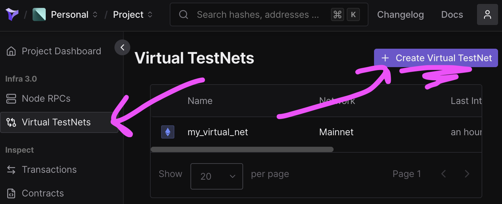
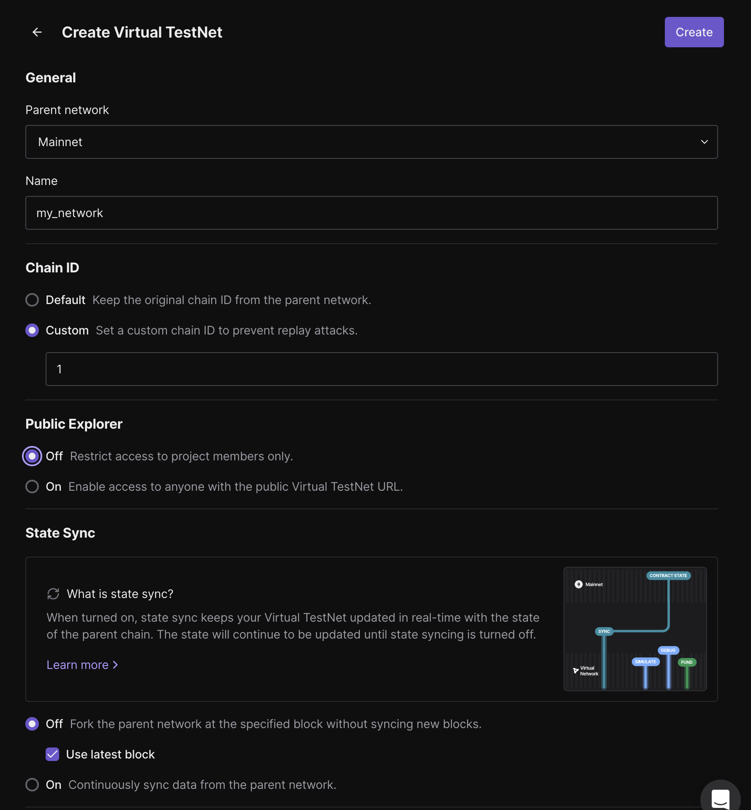
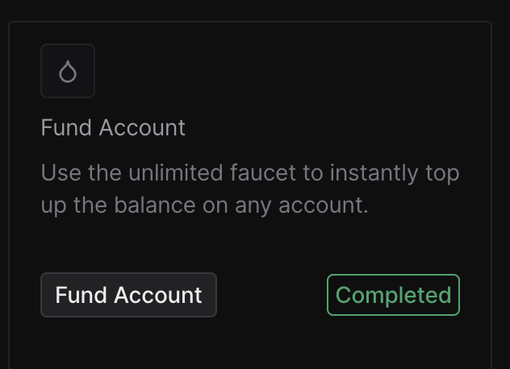
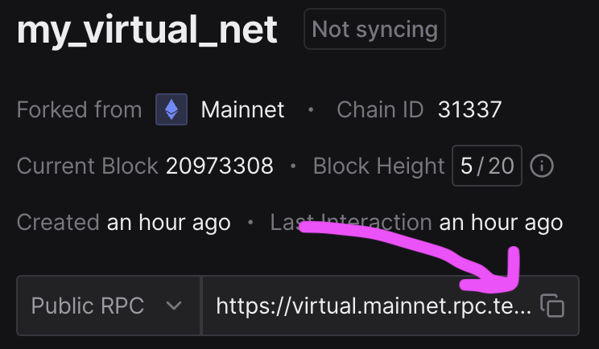

# web3py Favorites

This is from the [Cyfrin Updraft Vyper Course]().

- [web3py Favorites](#web3py-favorites)
- [Getting Started](#getting-started)
  - [Prerequisites](#prerequisites)
    - [Optional prerequisites](#optional-prerequisites)
    - [Optional Gitpod or CodeSpaces](#optional-gitpod-or-codespaces)
  - [Installation](#installation)
    - [uv](#uv)
    - [pip/python](#pippython)
  - [Quickstart](#quickstart)
- [Deploying with Python](#deploying-with-python)
  - [1. Setup Tenderly Virtual Network](#1-setup-tenderly-virtual-network)
  - [2. Fund a wallet](#2-fund-a-wallet)
  - [3. Get your RPC URL](#3-get-your-rpc-url)
  - [The Unsafe Way](#the-unsafe-way)
    - [4. Run the unsafe version](#4-run-the-unsafe-version)
  - [The Safer Way](#the-safer-way)
  - [4. Encrypt your private key](#4-encrypt-your-private-key)
    - [5. Run the safe version](#5-run-the-safe-version)
- [Maintainer notes](#maintainer-notes)
  - [Build a new requirements.txt](#build-a-new-requirementstxt)


# Getting Started

## Prerequisites

- [uv](https://docs.astral.sh/uv/)
  - You'll know you've done it right if you can run `uv --version` and see a version number.
- [git](https://git-scm.com/)
  - You'll know you've done it right if you can run `git --version` and see a version number.

### Optional prerequisites

If you're an advanced python user, you can use virtual environments and classic python/pip to work here.

- [python](https://www.python.org/)
- [pip](https://pypi.org/project/pip/)

### Optional Gitpod or CodeSpaces

If you can't or don't want to run and install locally, you can work with this repo in Gitpod. If you do this, you can skip the `clone this repo` part.

<div style="display: flex; justify-content: center; gap: 20px;">
  <a href="https://gitpod.io/#github.com/cyfrin/web3py-favorites-cu">
    
  </a>
  <a href="https://github.dev/Cyfrin/web3py-favorites-cu">
    
  </a>
</div>


## Installation

```bash
git clone https://github.com/cyfrin/web3py-favorites-cu
cd web3py-favorites-cu
```

### uv 

```bash
uv sync
```

### pip/python

```bash
python -m venv ./venv
source ./venv/bin/activate
pip install -r requirements.txt
```

## Quickstart

```bash
uv run hello.py # for UV
# or
python hello.py # for pip/python
```

# Deploying with Python

## 1. Setup Tenderly Virtual Network

Go to [tenderly](https://dashboard.tenderly.co/) and sign up, and then select `Create Virtual TestNet`.



Your config should look like this:



## 2. Fund a wallet

Select your network, and hit `Fund Account` and paste in an address.

We recommend using `0xf39Fd6e51aad88F6F4ce6aB8827279cffFb92266` since it's a well-known testing address. 



## 3. Get your RPC URL

Create a `.env` file, get your RPC URL from the tenderly dashboard, and add it to your `.env` file.



Example `.env`:

```bash
RPC_URL=https://asdfasdfs
```

## The Unsafe Way

### 4. Run the unsafe version

Add your private key to your `.env` file. This should be the private key associated with the account you funded. If you used the address above, use the following:

_example `.env`_
```bash
RPC_URL="your_rpc_url"

# NEVER DO THIS WITH A REAL KEY!!!
PRIVATE_KEY="0xac0974bec39a17e36ba4a6b4d238ff944bacb478cbed5efcae784d7bf4f2ff80"
MY_ADDRESS="0xf39Fd6e51aad88F6F4ce6aB8827279cffFb92266"
```

This is OK since the address and private key are well known testing keys.

Then, you can run:

```bash
uv run deploy_favorites_unsafe.py # uv
# or
python deploy_favorites_unsafe.py # pip/python
```

And you'll deploy the contract!

## The Safer Way

## 4. Encrypt your private key

We want you to practice not having your private key in plain text! So run the following:

```bash
uv run encrypt_key.py # uv 
# or
python encrypt_key.py # pip/python
```

This will prompt you for a password and private key. We recommend using the following:

```
0xac0974bec39a17e36ba4a6b4d238ff944bacb478cbed5efcae784d7bf4f2ff80
```

Since this is a well-known testing key, feel free to use an easy password - TYPICALLY YOU SHOULD NEVER SHARE YOUR PRIVATE KEY.

### 5. Run the safe version

```bash
uv run deploy_favorites.py # uv
# or
python deploy_favorites.py # pip/python
```

This will prompt you for a password to decrypt, and then you'll deploy your contract without exposing your private key! Huzzah!

# Maintainer notes

If you're a student, ignore this section!

## Build a new requirements.txt

```bash
uv pip compile pyproject.toml -o requirements.txt
```